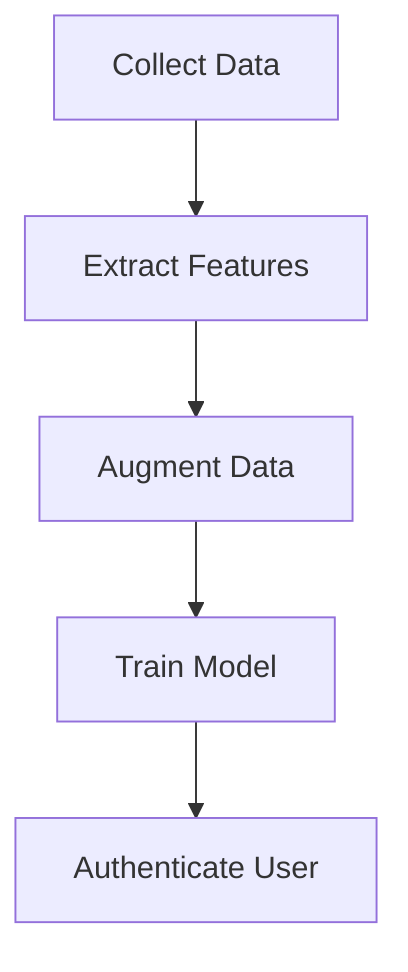

# 🎤 Voice Authentication System

🚀 **Voice Authentication System** uses state-of-the-art audio processing and machine learning techniques to authenticate users based on their voice. 

🔐 **Secure** | 🎛️ **Flexible** | 🤖 **AI-Powered**

---

## 🌟 Features

✨ **Real-time Voice Authentication**  
🎶 **Audio Feature Extraction using `librosa`**  
🤝 **Robust Machine Learning Models** (SVM, Isolation Forest)  
📊 **Detailed Logging of Authentication Attempts**  
📈 **Data Augmentation for Enhanced Model Accuracy**

---

## 🛠️ Technologies Used

| Technology         | Purpose                      |
|---------------------|------------------------------|
| 🎛️ `sounddevice`    | Audio recording             |
| 🎶 `librosa`         | Feature extraction          |
| 🤖 `scikit-learn`    | ML model training           |
| 🧰 `numpy`           | Data manipulation           |
| 📂 `pickle`          | Model persistence           |

---

## 🎯 Workflow

🌈 Features in Detail

📥 Data Collection

Collect voice samples from multiple users.

Augment the data for better accuracy using techniques like:

🎵 Pitch shifting

⏩ Time stretching

🌫️ Noise addition

📊 Model Training

Train an SVM classifier for user authentication.

Train an Isolation Forest for anomaly detection.

🔍 Authentication

Real-time voice matching.

Secure user authentication with threshold-based similarity scoring.

📃 Logs and Models

Authentication Logs: Stores all attempts with timestamps.

Model Storage: Trained models are saved for future use.

📜 License
This project is licensed under the MIT License.

⭐ Like the Project?
If you find this project helpful, feel free to give it a ⭐ on GitHub! 💖
